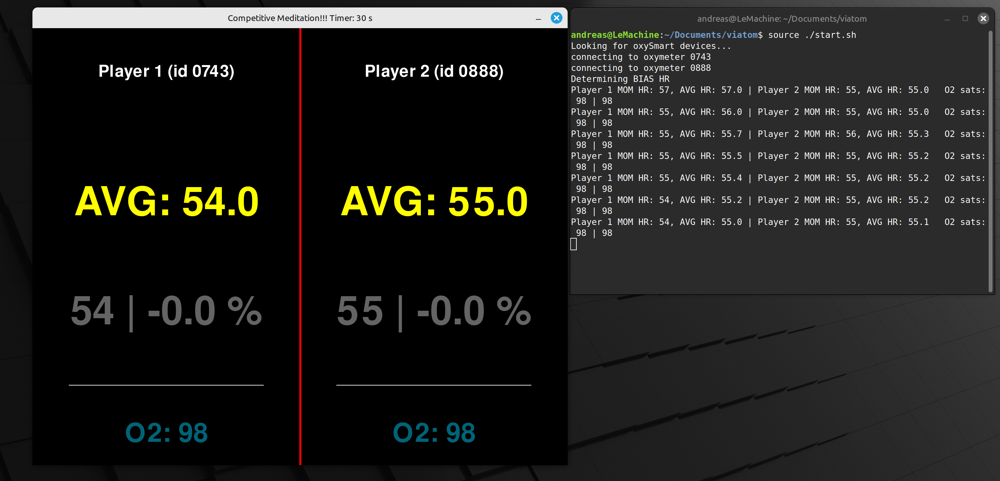

<h1>Competitive Meditation</h1>

In our modern world, entangled in social media, dripping in cheap dopamin, we lack one thing - real relaxation.
We now how to meditate but we don't do it. Why not? Because there is nothing to win in a traditional sense.

Competitive Meditation changes this.

It is a GAME, where two players attach bluetooth enabled viatom/Wellue pulse oxymeters (24 $ on Amazon: [Pulse Oxymeter](https://www.amazon.com/Wellue-Fingertip-Saturation-Batteries-Bluetooth/dp/B085ZFDMMX/ref=sr_1_37?crid=5ZGC528ETVZC&dib=eyJ2IjoiMSJ9.3zVgN8RafpK4S_6amYebMU9jWzx1d3q5ajTYuR2ITVGUSb4m8vb6Em4k2MDmVUd9hNePUKWzDRny026wON7TbqAkqufqMaxrBJtYfcaSicc2qEAp9YfIQYqUGk2tE3JGNFqT0ZWZ70bL_AeYyqY8TwH1ZK8eyB9onl85Mt33iavTn1JsXDhgq-yvJ9Puf82JuBvr67823lPLUhly5mO0mY8-AmeXEl3nRgtZkl1MqsKxCtve8DTE_qUjwBI3wI8iw15xpms057KMHsnKG-qCLuL3hXRo-1FfShMfBzwZgDM.KXA9-1iaVll9Ob8w9FnUNaQ1UxK67Pb-ZRH7xQn2tQ0&dib_tag=se&keywords=viatom%2Bpulse%2Boximeter&qid=1749828112&sprefix=viatom%2Bpulse%2Boxymete%2Caps%2C197&sr=8-37&th=1)

First start the CompetitiveMeditation.py script (it uses asyncio.run, so start it from shell). It automaticaly finds and conects the two devices.

Then the GUI will start automatically. After pressing ENTER, the program determines the AVG heartrate over ten seconds. Then it measures the decline in heart rate over a pre determined time.
Whoever meditates/relaxes HARDER, will have a stronger drop in heart rate and therefore win the GAME!

You can increase/decrease the meditaiton time with the up/down keys and start/restart the game by hitting Enter.

If everything works (and I am sure it will). It should look something like this:




````
pip install pygame
pip install numpy
pip install bleak
````
